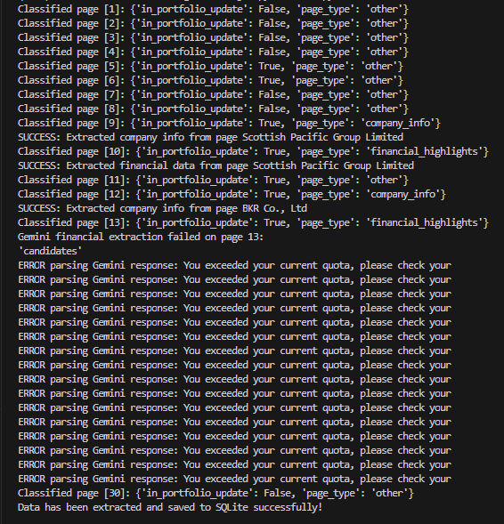
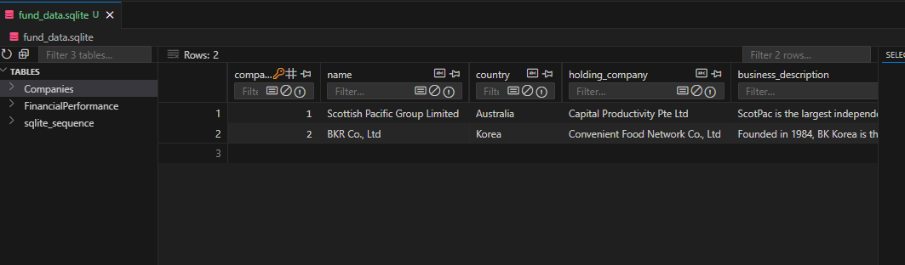

**Repo:** `mirarc/assignment-16-jun`

## Part 1

Please see the [`part-1-soc.md`](part-1-soc.md) file for detailed content and scope of work.

## Part 2: Setup and Run Guide

### 1. Create a Python virtual environment in the current folder:

```bash
python -m venv venv
```

### 2. Activate the virtual environment:

- **Windows:**

  ```bash
  venv\Scripts\activate
  ```

- **macOS/Linux:**

  ```bash
  source venv/bin/activate
  ```

### 3. Install required libraries (if `requirements.txt` exists):

```bash
pip install -r requirements.txt
```

### 4. After adding Gemini `API_KEY` to `main.py`, run the program:

```bash
python main.py
```


### 5. Check the output:

After running, check the `fund_data.sqlite` file.



